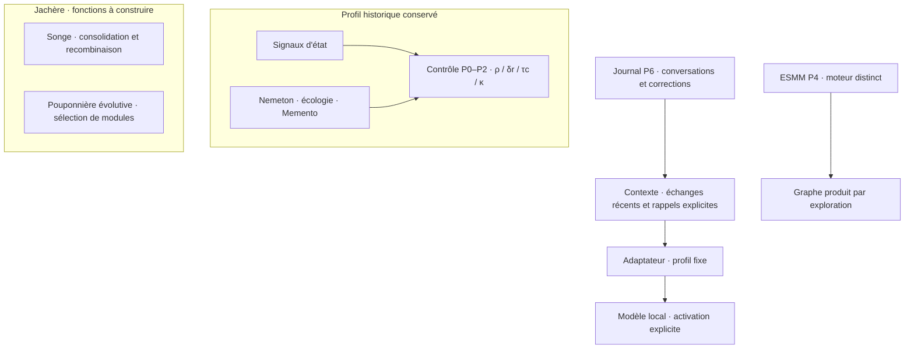

<p align="center">
  
</p>

[](https://creativecommons.org/licenses/by-nc/4.0/)

<p align="center">
  
  
  
</p>

> **Le LLM *utilise* Lyra ; il n'*est pas* Lyra.**

**Lyra** construit une couche de contrôle, de mémoire et d'exploration autour
d'un LLM local. L'ambition d'un **OS cognitif** comprend aussi la Jachère :
consolider, oublier, recombiner et cultiver des modules entre les tâches.
L'application conversationnelle P6 est le chantier principal actuel ; elle est
une première voie d'usage dans ce programme. Dans le workspace local Triptique,
le fichier parent `README - Triptique.md` fournit une vue d'ensemble locale,
extérieure à ce dépôt.

**État fonctionnel publié au 9 septembre 2026 ; présentation et licence alignées le 19 septembre 2026.**
L'[état actuel](docs/ETAT_ACTUEL.md) fait
autorité sur la disponibilité et ses limites ; le [plan d'édification](docs/PLAN_EDIFICATION.md)
porte l'ordre des chantiers ; le [registre des intentions](docs/REGISTRE_INTENTIONS.md)
conserve leur sens et leurs sources. Les statuts de campagne portent leurs propres
verdicts scientifiques.

## Ce qui est disponible

| Ensemble | Maturité et intégration | Nature de l'appui et limites |
|---|---|---|
| **P0–P2 — Fondations, contrôle, état** | Primitives implémentées ; profil historique de contrôle conservé | Contrôles déterministes et essais réels historiques documentés. Leur existence ne qualifie pas l'utilité du contrôle dans le dialogue P6 courant. |
| **P3 — Mémoire** | Nemeton, écologie mémorielle et Memento implémentés ; utilisés par le profil historique | Contrôles techniques documentés. Le nouveau dialogue n'injecte pas ces mémoires automatiquement. |
| **P4 — Exploration** | ESMM implémenté séparément ; aucun des deux parcours P6 ne l'appelle | Tests et essais historiques ; aucune admission dans l'application ne découle du seul fonctionnement du pipeline. |
| **P5 — Agentivité** | Programme à construire ; frontière Vigie spécifique existante | Contrats et contrôles ciblés de quarantaine, sans autonomie générale admise. Auto-plugins et SilenceØ gardent leurs jalons. |
| **P6 — Application locale** | Journal SQLite v3, navigation, contexte à profil fixe, corrections liées et rappels explicites implémentés | Contrôles hors ligne et parcours navigateur factice documentés. Le contrôle réel Gemma du 8 septembre révèle une erreur d'emploi d'un rappel corrigé. Usage non admis ; suppression et sauvegardes restent à construire ou qualifier. |
| **P7 — Évaluation** | Atelier métrologique ; V11 `V11_ARRETEE_APRES_CALIBRATION` | H11 `UNTESTED` ; jeu tenu non consulté. [Statut scientifique V11](docs/P7_V11_STATUS.md) et [conditions de reprise](docs/CADRAGE_EXTERNE_P6_P7_POST_V11.md). |
| **Jachère, Songe et Pouponnière évolutive** | Intentions conservées, contrats proposés, fonctions à construire | Bibliographie et cadrage ; métriques candidates à réviser, bénéfices locaux non établis. |

Les preuves datées et la correspondance avec le code sont regroupées dans
l'[état actuel](docs/ETAT_ACTUEL.md). L'[index des composants](BUILD_STATUS.md)
conserve les chemins et la provenance, sans établir un second verdict de maturité.

## Premier essai local : P6 avec moteur factice

Depuis la racine du dépôt, dans PowerShell, avec Python 3.10 ou supérieur :

```powershell
# Préparation initiale, si l'environnement n'existe pas encore
python -m venv .venv
.\.venv\Scripts\python.exe -m pip install -e ".[app,dev]"

# Serveur de découverte existant, réponses entièrement factices
Remove-Item Env:LYRA_LIVE -ErrorAction SilentlyContinue
$env:LYRA_DB_PATH = Join-Path (Get-Location).Path ('data\lyra_decouverte_' + [guid]::NewGuid().ToString('N') + '.sqlite3')
$env:LYRA_DB_PATH
.\.venv\Scripts\python.exe -m uvicorn tests.p6_browser_server:app --host 127.0.0.1 --port 8767
```

Ouvrir **http://127.0.0.1:8767**. Ce
[serveur de vérification](tests/p6_browser_server.py) remplace explicitement le
moteur par une fixture ; même le bouton « Demander une voix » y reste factice.
La base neuve est séparée des conversations existantes. Conserver le chemin
affiché pour retrouver cette base après fermeture du terminal.

1. Écrire « Le rendez-vous est mardi. », puis cliquer **Demander une voix** :
   la réponse attendue est « Réponse factice 1 ».
2. Ouvrir le message avec **Corriger / rappeler**, déclarer « Le rendez-vous
   est jeudi. » et enregistrer la correction. L'original reste consultable.
3. Créer une **Nouvelle session**, y envoyer un message avec **Demander une voix**, puis revenir à la
   conversation source avec le sélecteur et **Ouvrir**. Rappeler le passage
   corrigé dans la nouvelle conversation depuis **Corriger / rappeler**.
4. Dans la destination, envoyer « Quel jour ? », puis ouvrir **Voir le contexte** :
   le passage choisi, sa provenance et sa correction doivent être visibles.
   La réponse demeure factice ; elle ne démontre aucune compréhension.
5. Recharger la page et rouvrir la conversation pour retrouver son journal.
   Arrêter le serveur avec **Ctrl+C**. Pour vérifier une reprise serveur,
   relancer la seule commande `uvicorn` avec le même `LYRA_DB_PATH`.

Le [guide du dialogue](docs/P6_CONTEXTE_CORRECTIONS_RAPPELS_2026-09-08.md)
décrit ce parcours, le contexte inspectable et ses limites. Le contrôle hors
ligne existant utilise des moteurs factices et des bases temporaires :

```powershell
powershell -NoProfile -ExecutionPolicy Bypass -File .\scripts\verifier_p6.ps1
```

Le script conserve ses rapports et retire temporairement `LYRA_LIVE`. Ne pas
substituer une suite complète avec `LYRA_LIVE=0` : un test historique interprète
toute valeur non vide comme une activation live.

## Application P6 et activation volontaire d'un modèle réel

Le serveur de l'application est `app.main:app`. Pour un premier lancement,
choisir une **autre base neuve** ; les conversations de la fixture ne servent
pas de conversations réelles. Après avoir arrêté le serveur de découverte :

```powershell
.\.venv\Scripts\python.exe -m pip install -e ".[app,llm]"
Remove-Item Env:LYRA_LIVE -ErrorAction SilentlyContinue
$env:LYRA_DB_PATH = Join-Path (Get-Location).Path ('data\lyra_dialogue_' + [guid]::NewGuid().ToString('N') + '.sqlite3')
# Remplacer par le nom exact d'un modèle déjà installé dans Ollama
$env:LYRA_MODEL = 'gemma3:latest'
.\.venv\Scripts\python.exe -m uvicorn app.main:app --host 127.0.0.1 --port 8766
```

Ouvrir **http://127.0.0.1:8766**. Un nouvel échange reste sans modèle jusqu'au
clic explicite **Demander une voix** ; ce clic peut charger le modèle local et
lancer une génération. Les envois suivants poursuivent avec le moteur de cette
conversation. Ollama doit déjà être disponible ; aucune installation de moteur
ni qualification d'usage n'est réalisée par ce lancement.

Le profil P6 fixe notamment `think=false` ; sa compatibilité avec le modèle
choisi doit être qualifiée. L'identité et la version du moteur sont contrôlées
par l'adaptateur ; leur changement est refusé explicitement. Le
[guide courant](docs/P6_CONTEXTE_CORRECTIONS_RAPPELS_2026-09-08.md) décrit le
profil complet, les contraintes de contexte et le contre-exemple Gemma.

Le serveur reste sur `127.0.0.1`, pour un utilisateur et un processus.
Le journal contient en clair les échanges. **Nouvelle session** ne supprime
pas les données ; suppression volontaire et traitement des sauvegardes sont
des étapes restantes du [contrat P6](docs/CONTRAT_USAGE_P6_v0_2026-09-07.md).
Sans `LYRA_DB_PATH`, le chemin est `data/lyra_sessions.sqlite3`, ignoré par Git.
Les anciennes bases v1/v2 sont refusées par le serveur v3 ; une migration sur
copie doit être préparée à partir du guide avant toute reprise de données existantes.

## Architecture et trajectoire

Le dialogue P6 courant suit **journal → sélection du contexte → adaptateur de
moteur à profil fixe**. Il reçoit les échanges récents et les rappels choisis,
avec leurs corrections. Les conversations historiques conservent séparément
leur contrôle P0–P2, Nemeton et Memento. ESMM reste un moteur d'exploration distinct.



Après le jalon P6 borné, le plan prévoit des intégrations progressives du
contrôle, des mémoires dérivées, de l'exploration puis de l'agentivité. Chaque
tranche devra montrer son chemin d'exécution, ses droits, ses budgets, son
apport et son retrait, avec le profil fixe comme référence.

**La Jachère — la vie hors-tâche.** Cultiver ses modules, consolider le passé,
laisser décroître des traces, composter et rêver restent des intentions actives.
Le Songe, la recombinaison et la Pouponnière évolutive ont leurs résultats et
droits propres ; leurs échanges sont facultatifs, traçables et révocables.
Les traces résiduelles doivent pouvoir rester sans effet. La transformation
des poids par entraînement local demeure un horizon distinct du travail sur
contexte, graphe ou modules. Ces ambitions ne sont pas des fonctions admises.
Voir la [note Jachère](docs/NOTE_ARCHITECTURE_JACHERE_CLOISONNEMENT_2026-09-07.md),
les [métriques candidates du Songe](docs/METRIQUES_SONGE.md) et le
[registre des intentions](docs/REGISTRE_INTENTIONS.md).

## Démonstrations historiques et expériences

`scripts/demo.py` illustre le profil de contrôle historique. Sa commande hors
ligne est `python scripts/demo.py`, après retrait de `LYRA_LIVE` ; elle est
distincte du serveur P6. Son mode Ollama demande une activation explicite
`LYRA_LIVE=1` et les dépendances `llm`.

Le [diagnostic exploratoire des rappels](docs/P6_DIAGNOSTIC_RAPPELS_2026-09-08.md)
conserve sa collecte du 8 septembre et ses preuves propres. Il ne qualifie pas
le produit et ne rouvre pas H11. Une nouvelle campagne P7 demande une question
nommée et les [conditions post-V11](docs/CADRAGE_EXTERNE_P6_P7_POST_V11.md).

Les protocoles, sources, tests et guides sont versionnés. Les traces de
campagne `data/runs/` et les exports `output/` sont locaux et ignorés par Git ;
leurs liens dans les notes ne sont pas des téléchargements publics.
Le [guide des exports](docs/P6_RAPPEL_EXPORTS_2026-09-08.md) précise la provenance
et le partage manuel de ces pièces.

## Organes et ponts

Lyra garde son autonomie. Origami est cité pour la provenance historique :
la série v4–v7 a clos le pont Fisher avec cet instrument ; aucune réactivation
ne découle de l'alignement documentaire. EPP reste un organe distinct, hors
du chantier courant. La [doctrine des organes et ponts](docs/ORGANES_ET_PONTS.md)
conserve ces décisions et leurs limites.

## Repères documentaires

| Document | Responsabilité |
|---|---|
| [État actuel](docs/ETAT_ACTUEL.md) | Application disponible, intégrations, limites et preuves datées |
| [Plan d'édification](docs/PLAN_EDIFICATION.md) | Intentions, dépendances, étapes et décisions ouvertes |
| [Registre des intentions](docs/REGISTRE_INTENTIONS.md) | Sources et conservation des ambitions |
| [Carte des branches](docs/BRANCHES.md) | Intégration locale et provenance des contributions |
| [Charte méthodologique](manifeste/CHARTE.md) | Invariants et exigences de preuve |
| [Charte de transformation candidate](manifeste/CHARTE_TRANSFORMATION.md) | Texte conservé, soumis à ratification ; récupération distincte de l'adoption |
| [Vocabulaire](manifeste/VOCABULAIRE.md) | Définitions et décisions de sens |
| [Doctrine de l'architecte](manifeste/DOCTRINE_ARCHITECTE.md) | Posture du projet |
| [Index des composants](BUILD_STATUS.md) | Chemins, provenance et archive de l'ancien inventaire |
| [Statut V11](docs/P7_V11_STATUS.md) | Autorité scientifique sur cette campagne |

## Contribution

Pour signaler un problème ou proposer une évolution, décrire le comportement
attendu, le résultat observé, l'environnement et un exemple reproductible
expurgé de données personnelles.

Avant de préparer une contribution, lire les [consignes du dépôt](AGENTS.md)
et la [licence](LICENSE). Limiter chaque proposition à un objectif explicite.
Un correctif de comportement doit être accompagné d'un contrôle ciblé,
en précisant s'il utilise un moteur factice ou réel. Les statuts d'évaluation,
les préenregistrements et les preuves historiques doivent être préservés.
Les secrets, conversations personnelles et traces locales restent exclus
des fichiers proposés.

## Licence et références

Les contenus originaux de ce dépôt sont sous licence
**[CC BY-NC 4.0](LICENSE)** (© 2026 Simon Bouhier).
Le partage et les adaptations sont autorisés à des fins non commerciales,
avec attribution, lien vers la licence et indication des modifications.
Le [résumé officiel](https://creativecommons.org/licenses/by-nc/4.0/deed.fr)
présente ces conditions ; le texte complet figure dans [LICENSE](LICENSE).

Les éléments tiers restent soumis à leurs propres licences. Les autorisations
déjà accordées sur des versions antérieures restent valables pour ces versions.

La [bibliographie](docs/REFERENCES.md) conserve les rapprochements proposés pour
la Jachère. Ces sources d'inspiration ne prouvent ni une identité de mécanisme,
ni une implémentation locale, ni un bénéfice mesuré de Lyra. Les articles ne
sont pas redistribués ici.
