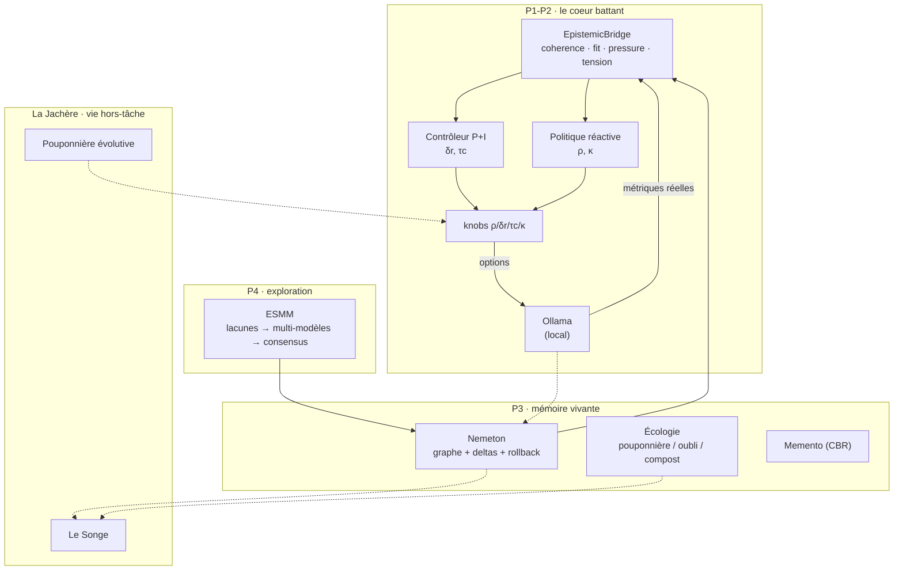

<p align="center">
  
</p>

<p align="center">
  
  
  
  
</p>

<p align="center"><em>A local control and memory layer for LLMs — application under construction.</em></p>

---

> **Le LLM *utilise* Lyra ; il n'*est pas* Lyra.**

**Lyra** est une couche de contrôle et de mémoire au-dessus d'un LLM local
(Ollama). Elle module des paramètres de génération, conserve un graphe de
concepts et un état de session, et dispose d'un moteur d'exploration distinct.
P6, l'application locale, est le chantier principal. La Jachère et le Songe
restent des pistes de recherche et de construction, sans calendrier de livraison.

Ce dépôt consolide des designs issus des prototypes antérieurs.
L'[état courant daté](docs/ETAT_ACTUEL.md) distingue les briques testées, leur
intégration effective dans l'application et les bénéfices encore à démontrer.

## État réel

*(Ce tableau décrit ce qui existe et est testé — pas la vision. Règle maison :
aucun chiffre non reproductible, aucun pipeline « vert mais vide ».)*

| Couche | Quoi | État |
|---|---|---|
| **P0 — Fondations** | boutons ρ/δr/τc/κ → options de génération (source unique), charte, vocabulaire | ✅ testé |
| **P1 — Contrôle** | contrôleur P+I à intégrateur fuyant (gains calibrés sur runs réels), garde-fous EWMA/hystérésis/réfractaire | ✅ testé |
| **P2 — État cognitif** | signaux épistémiques réels (cohérence/fit/pression/tension) pilotant le P+I ; phase λ ; surface affective (théâtre honnête, opt-in) | ✅ validé en génération réelle |
| **P3 — Mémoire** | graphe *nemeton* (deltas auditables + rollback), écologie mémorielle (oubli différé + réveil du compost), rappel par cas (Memento) | ✅ testé |
| **P4 — Exploration** | ESMM : lacunes → exploration multi-modèles → **consensus sémantique à 2 niveaux** → graphe. Premier pipeline productif de l'histoire du projet | ✅ validé live (3 modèles) |
| P5 — Agentivité | outils + auto-plugins + SilenceØ | ⬜ à construire |
| **P6 — Application** | journal SQLite v3, contexte conversationnel à profil fixe, corrections liées, rappels explicites et navigation ; ancien profil de contrôle conservé séparément | 🟡 73 tests Python + 9 JavaScript réussis le 8 septembre ; parcours navigateur vérifié. Contrôle réel Gemma : transport conforme, erreur d'interprétation d'un rappel corrigé. Qualité d'usage, suppression et sauvegardes restent à qualifier ou construire. [Preuves et limites](docs/P6_CONTEXTE_CORRECTIONS_RAPPELS_2026-09-08.md) |
| **P7 — Évaluation** | V11 : Q0 franchie, calibration complète, Q1 arrêtée par une stabilité insuffisante et des confonds budget/longueur | 🧪 atelier métrologique ; H11 `UNTESTED`, 60 cas tenus intacts, aucune V12 avant validation conjointe de l'instrument ([preuve](docs/P7_V11_STATUS.md)) |
| **La Jachère** | Consolidation et recombinaison autonomes ; Pouponnière évolutive et ponts facultatifs | 📐 cadrage du 7 septembre ; métriques candidates à réviser, bénéfices non établis |

Le [diagnostic des rappels corrigés](docs/P6_DIAGNOSTIC_RAPPELS_2026-09-08.md)
dispose d'un plan exploratoire scellé et de 6 336 réponses sur quatre configurations,
après quatre appels d'admission technique. Les 212 tests de cet instrument séparé
ont réussi ; ils ne remplacent pas les contrôles de l'application P6.
Les [dossiers de relecture séparée](docs/P6_RELECTURE_MODE_EMPLOI_2026-09-08.md)
sont préparés ; la confirmation indépendante et l'admission d'usage restent ouvertes.

Le dépôt versionne le protocole, les sources, les tests et les guides. Les traces
de campagne (`data/runs/`) et les archives de partage (`output/`) restent locales,
ignorées par Git : leurs liens documentaires ne sont pas téléchargeables sur GitHub.
Le [guide d'exécution](experiments/p6_recall/README.md) permet de reproduire la
collecte ; le [guide des exports](docs/P6_RAPPEL_EXPORTS_2026-09-08.md) décrit les
paquets à produire et à transmettre manuellement.

Le [lot publié et la provenance des preuves](docs/P6_PUBLICATION_2026-09-08.md)
précisent le contenu disponible sur GitHub et les pièces conservées localement.

## Architecture

Le schéma ci-dessous décrit les briques de contrôle et de recherche. Le nouveau
dialogue P6 suit une voie distincte : journal → sélection du contexte → adaptateur
de moteur à profil fixe. Il n'active pas automatiquement ces briques.



## Démarrage

```bash
python -m pytest -q          # suite complète ; voir les résultats datés dans docs/ETAT_ACTUEL.md
python scripts/demo.py       # démo hors-ligne, déterministe
LYRA_LIVE=1 python scripts/demo.py   # avec un Ollama réel (pip install requests)
```

Sous PowerShell, un modèle Ollama téléchargé peut être sélectionné sans
modifier le code. Les modèles à raisonnement séparé doivent recevoir une
politique explicite afin que Lyra consomme bien leur canal final :

```powershell
$env:LYRA_MODEL = 'qwen3.8:27b'
$env:LYRA_THINK = 'false'
$env:LYRA_LIVE = '1'
.\.venv\Scripts\python.exe scripts\demo.py
```

Sans `LYRA_THINK`, le champ n'est pas envoyé et le comportement historique du
modèle est conservé. Une valeur mal orthographiée est refusée plutôt que
silencieusement interprétée.

La porte locale utilise par défaut `data/lyra_sessions.sqlite3` (ignoré par Git).
**Depuis la tranche conversationnelle du 8 septembre, le serveur attend le format v3.** Une
ancienne base v1 ou v2 est refusée ; la migration préparée crée une copie neuve et
ne s'exécute pas automatiquement. `LYRA_DB_PATH` permet de choisir cette copie.
Voir le [guide du dialogue P6](docs/P6_CONTEXTE_CORRECTIONS_RAPPELS_2026-09-08.md) avant de
relancer une installation existante avec `Ouvrir Lyra.vbs`.

Le navigateur conserve une copie locale des envois avant leur acceptation par
le serveur. Il retrouve le journal et les indicateurs de sa conversation ;
« Nouvelle session » change ce pointeur sans supprimer les données durables.
Le journal v3 conserve les nouveaux échanges au-delà des 50 tours de l'historique
interne de contrôle. Les lacunes des archives v1 restent signalées.

Le nouveau dialogue reçoit les échanges récents et les passages explicitement
rappelés, avec leurs corrections. Le contexte de chaque tentative est inspectable.
L'ancien profil de contrôle reste identifiable dans les conversations historiques.

**Concurrence et reprise :** une demande est enregistrée avant sa génération.
Sa répétition retrouve son statut ou sa réponse ; un nouvel envoi dans une
conversation occupée reçoit 409. L'accès à une autre conversation reste possible.
Le périmètre est un registre dans un processus. Les contrôles du 8 septembre
donnent 73 réussites Python et 9 JavaScript. Le
[guide courant](docs/P6_CONTEXTE_CORRECTIONS_RAPPELS_2026-09-08.md) conserve les
preuves, le parcours navigateur et la limite sémantique du contrôle Gemma réel.
Le rejeu du 7 septembre reste une preuve historique distincte. Commande hors ligne :

```powershell
powershell -NoProfile -ExecutionPolicy Bypass -File .\scripts\verifier_p6.ps1
```

Cette base contient en clair les prompts, sorties et états internes nécessaires
à la reprise. Le serveur reste volontairement lié à `127.0.0.1` : tant que
l'authentification minimale n'est pas construite, il ne doit pas être exposé
sur le réseau.

Le noyau (`core/`, `memory/`) est **pure stdlib**. Options : `requests` (Ollama),
`numpy/matplotlib` (recherche).

## L'écosystème — organes et ponts

Lyra est un organe parmi trois, **indépendants par doctrine** (chacun fonctionne
sans les autres ; un pont ne se dégèle que sur validation pré-enregistrée) :

| Organe | Rôle | Lien |
|---|---|---|
| **lyra_reborn** | l'OS cognitif (ce dépôt) | — |
| **Origami Transformer** | l'instrument métrologique — géométrie de Fisher des représentations, hypothèses pré-enregistrées | [repo](https://github.com/SimonBouhier/Origami_Transformer) |
| **EPP Verdict** | le moteur d'attestation épistémique | [docs](https://epp-verdict-docs.vercel.app) |

> État final, 2026-07-26 : le signal brut observé en v5 n'a pas survécu aux
> contrôles renforcés de v6–v7. La campagne v7 a rendu `HF_DÉMENTI` sur 0/6
> modèles ; le pont Fisher vers Lyra et EPP reste gelé. Ce gel est une décision
> d'ingénierie stable, pas une dette. Voir `docs/ORGANES_ET_PONTS.md`.

## La Jachère — la vie hors-tâche

Ce que Lyra fera quand elle ne répond pas : **cultiver** ses propres modules de
harness (évolution hors-ligne, adaptation par cas en ligne — fondée sur la
littérature *scaffolding self-improvement* et *harness effect*) et **rêver**
(consolidation + recomposition des vecteurs du passé, paradigme *sleep/dreaming*,
métriques candidates de nouveauté et de consolidation). Le cadrage du 7 septembre
sépare les fonctions et leurs critères de réussite, avec des échanges
facultatifs, traçables et révocables. Voir la
[note d'architecture](docs/NOTE_ARCHITECTURE_JACHERE_CLOISONNEMENT_2026-09-07.md),
la [bannière](docs/BANNIERE_LA_JACHERE.md) et les
[métriques à réviser](docs/METRIQUES_SONGE.md).

## Pour aller plus loin

| Document | Contenu |
|---|---|
| `docs/ETAT_ACTUEL.md` | état daté, limites d'usage et situation des branches |
| `manifeste/CHARTE.md` | les 6 règles anti-pathologies (chacune paie une leçon vécue) |
| `manifeste/VOCABULAIRE.md` | sens canonique + **décisions datées** |
| `manifeste/DOCTRINE_ARCHITECTE.md` | la posture qui gouverne le projet |
| `docs/PLAN_EDIFICATION.md` | le plan directeur (P0→P7 + Jachère + Vigie) |
| `docs/ORGANES_ET_PONTS.md` | doctrine inter-projets et état des ponts |
| [Note Jachère — cloisonnement](docs/NOTE_ARCHITECTURE_JACHERE_CLOISONNEMENT_2026-09-07.md) | décisions du 7 septembre, contrats proposés, preuves attendues et articulation P6 |
| [Contrat d'usage P6](docs/CONTRAT_USAGE_P6_v0_2026-09-07.md) | conversations séparées, conservation, corrections et ordre de réalisation |
| [Journal et cycle des demandes P6](docs/P6_JOURNAL_DEMANDES_2026-09-07.md) | réalisation de l'étape 2, preuves ciblées, commandes PowerShell et migration sur copie |
| [Contexte, corrections et rappels P6](docs/P6_CONTEXTE_CORRECTIONS_RAPPELS_2026-09-08.md) | état courant, frontière du moteur, migration v3 et preuves techniques distinctes de la qualité d'usage |
| [Diagnostic exploratoire des rappels P6](docs/P6_DIAGNOSTIC_RAPPELS_2026-09-08.md) | plan scellé, collecte achevée, vérification de l'instrument et limites scientifiques |
| [Mode d'emploi des relectures P6](docs/P6_RELECTURE_MODE_EMPLOI_2026-09-08.md) | pièces locales à partager, instruction commune et conservation séparée des retours |
| `docs/CADRAGE_EXTERNE_P6_P7_POST_V11.md` | état post-V11, priorités P6 et questions ouvertes pour audit/littérature |
| `BUILD_STATUS.md` | l'état exact, brique par brique, avec provenance |

## Licence & références

Code sous licence **MIT** (© 2026 Simon Bouhier). Les articles de recherche qui
fondent la Jachère ne sont pas redistribués ici — voir `docs/REFERENCES.md`
pour les liens arXiv.
