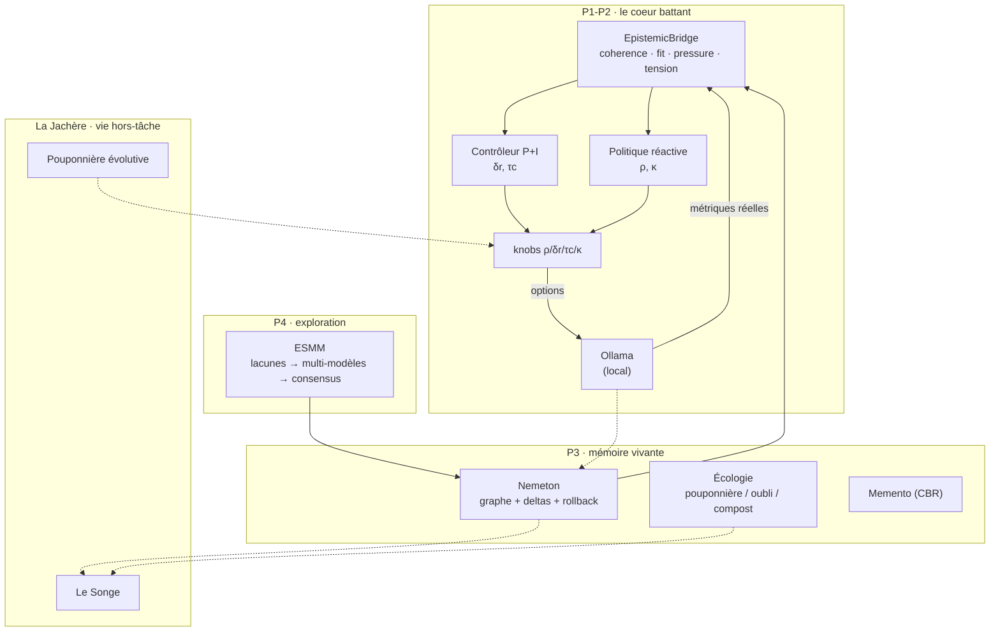

<p align="center">
  
</p>

<p align="center">
  
  
  
  
  
</p>

<p align="center"><em>An honest cognitive OS for local LLMs — control loop, living memory, autonomous exploration, and rest.</em></p>

---

> **Le LLM *utilise* Lyra ; il n'*est pas* Lyra.**

**Lyra** est une couche de contrôle cognitive au-dessus d'un LLM local (Ollama) :
un système qui **se règle lui-même** (quatre boutons ρ/δr/τc/κ pilotés par un
vrai contrôleur), qui **ressent son état** (signaux épistémiques dérivés de la
génération réelle), qui **oublie volontairement** pour mieux tenir ce qui compte
(écologie mémorielle : pouponnière / journal d'oubli / compost), qui **explore
seul** les lacunes de sa connaissance (consensus multi-modèles), et qui aura
bientôt une **vie hors-tâche** (la Jachère : cultiver ses propres modules, et
rêver).

Ce dépôt est une **consolidation** : le meilleur de ~23 prototypes (2019-2026),
audités ligne à ligne, ré-implémenté proprement — jamais copié. Chaque brique
annoncée comme faite est branchée, testée, et fait ce que la doc dit.

## État réel

*(Ce tableau décrit ce qui existe et est testé — pas la vision. Règle maison :
aucun chiffre non reproductible, aucun pipeline « vert mais vide ».)*

| Couche | Quoi | État |
|---|---|---|
| **P0 — Fondations** | boutons ρ/δr/τc/κ → options de génération (source unique), charte, vocabulaire | ✅ testé |
| **P1 — Contrôle** | contrôleur P+I à intégrateur fuyant (gains calibrés sur runs réels), garde-fous EWMA/hystérésis/réfractaire | ✅ testé |
| **P2 — État cognitif** | signaux épistémiques réels (cohérence/fit/pression/tension) pilotant le P+I ; phase λ ; surface affective (théâtre honnête, opt-in) | ✅ validé en génération réelle |
| **P3 — Mémoire** | graphe *nemeton* (deltas auditables + rollback), écologie mémorielle (oubli différé + réveil du compost), rappel par cas (Memento) | ✅ testé |
| **P4 — Exploration** | ESMM : lacunes → exploration multi-modèles → **consensus sémantique à 2 niveaux** → graphe. Premier pipeline productif de l'histoire du projet | ✅ validé live (3 modèles) |
| P5 — Agentivité | outils + auto-plugins + SilenceØ | ⬜ à construire |
| **P6 — Application** | serveur FastAPI local ; chat P0–P4 ; état complet des sessions persisté en SQLite et repris après redémarrage ; moteur isolé par session ; page locale | 🟡 première tranche verticale testée ; graphe REST, sélection multimodèle et auth minimale restent à construire |
| **P7 — Évaluation** | V11 : Q0 franchie, calibration complète, Q1 arrêtée par une stabilité insuffisante et des confonds budget/longueur | 🧪 atelier métrologique ; H11 `UNTESTED`, 60 cas tenus intacts, aucune V12 avant validation conjointe de l'instrument ([preuve](docs/P7_V11_STATUS.md)) |
| **La Jachère** | Pouponnière évolutive (harness auto-cultivé) + le Songe (sommeil/rêve) | 📐 fondé (littérature versée, métriques pré-spécifiées) |

## Architecture



## Démarrage

```bash
python -m pytest -q          # état vérifié : 284 réussis, 2 ignorés
python scripts/demo.py       # démo hors-ligne, déterministe
LYRA_LIVE=1 python scripts/demo.py   # avec un Ollama réel (pip install requests)
```

Sous PowerShell, un modèle Ollama téléchargé peut être sélectionné sans
modifier le code. Les modèles à raisonnement séparé doivent recevoir une
politique explicite afin que Lyra consomme bien leur canal final :

```powershell
$env:LYRA_MODEL = 'qwen3.8:27b'
$env:LYRA_THINK = 'false'
$env:LYRA_LIVE = '1'
.\.venv\Scripts\python.exe scripts\demo.py
```

Sans `LYRA_THINK`, le champ n'est pas envoyé et le comportement historique du
modèle est conservé. Une valeur mal orthographiée est refusée plutôt que
silencieusement interprétée.

La porte locale ouverte par `Ouvrir Lyra.vbs` conserve désormais chaque
session dans `data/lyra_sessions.sqlite3` (fichier ignoré par Git). Le
navigateur mémorise seulement son identifiant et reprend automatiquement son
état au redémarrage ; « Nouvelle session » oublie ce pointeur local sans
supprimer la session durable. `LYRA_DB_PATH` permet de choisir un autre
fichier SQLite.

Cette base contient en clair les prompts, sorties et états internes nécessaires
à la reprise. Le serveur reste volontairement lié à `127.0.0.1` : tant que
l'authentification minimale n'est pas construite, il ne doit pas être exposé
sur le réseau.

Le noyau (`core/`, `memory/`) est **pure stdlib**. Options : `requests` (Ollama),
`numpy/matplotlib` (recherche).

## L'écosystème — organes et ponts

Lyra est un organe parmi trois, **indépendants par doctrine** (chacun fonctionne
sans les autres ; un pont ne se dégèle que sur validation pré-enregistrée) :

| Organe | Rôle | Lien |
|---|---|---|
| **lyra_reborn** | l'OS cognitif (ce dépôt) | — |
| **Origami Transformer** | l'instrument métrologique — géométrie de Fisher des représentations, hypothèses pré-enregistrées | [repo](https://github.com/SimonBouhier/Origami_Transformer) |
| **EPP Verdict** | le moteur d'attestation épistémique | [docs](https://epp-verdict-docs.vercel.app) |

> État final, 2026-07-26 : le signal brut observé en v5 n'a pas survécu aux
> contrôles renforcés de v6–v7. La campagne v7 a rendu `HF_DÉMENTI` sur 0/6
> modèles ; le pont Fisher vers Lyra et EPP reste gelé. Ce gel est une décision
> d'ingénierie stable, pas une dette. Voir `docs/ORGANES_ET_PONTS.md`.

## La Jachère — la vie hors-tâche

Ce que Lyra fera quand elle ne répond pas : **cultiver** ses propres modules de
harness (évolution hors-ligne, adaptation par cas en ligne — fondée sur la
littérature *scaffolding self-improvement* et *harness effect*) et **rêver**
(consolidation + recomposition des vecteurs du passé, paradigme *sleep/dreaming*,
métriques de nouveauté et de consolidation pré-spécifiées avant toute ligne de
code). Voir `docs/BANNIERE_LA_JACHERE.md` et `docs/METRIQUES_SONGE.md`.

## Pour aller plus loin

| Document | Contenu |
|---|---|
| `manifeste/CHARTE.md` | les 6 règles anti-pathologies (chacune paie une leçon vécue) |
| `manifeste/VOCABULAIRE.md` | sens canonique + **décisions datées** |
| `manifeste/DOCTRINE_ARCHITECTE.md` | la posture qui gouverne le projet |
| `docs/PLAN_EDIFICATION.md` | le plan directeur (P0→P7 + Jachère + Vigie) |
| `docs/ORGANES_ET_PONTS.md` | doctrine inter-projets et état des ponts |
| `docs/CADRAGE_EXTERNE_P6_P7_POST_V11.md` | état post-V11, priorités P6 et questions ouvertes pour audit/littérature |
| `BUILD_STATUS.md` | l'état exact, brique par brique, avec provenance |

## Licence & références

Code sous licence **MIT** (© 2026 Simon Bouhier). Les articles de recherche qui
fondent la Jachère ne sont pas redistribués ici — voir `docs/REFERENCES.md`
pour les liens arXiv.
