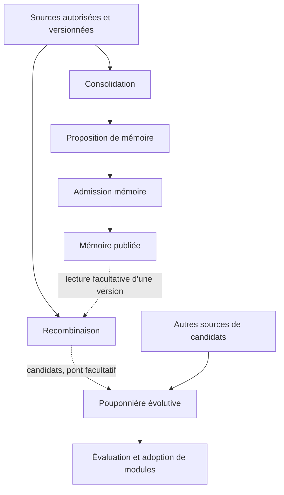

# Jachère — consolidation et recombinaison autonomes, coopération contrôlée

**Date : 7 septembre 2026. Version : v0 de cadrage.**
**Base de code examinée :** `788971a00f4303d2ba24cc671f4c0049fab772f9`.
**Statut :** orientation retenue avec Simon ; contrats techniques proposés,
non implémentés et non qualifiés. Cette note ne constitue ni un
préenregistrement scellé, ni une autorisation de campagne ou d'activation live.

## 1. Décision et portée

Simon souhaite faire coexister les deux fonctions envisagées du Songe :
améliorer la mémoire utilisable de Lyra et produire des candidats utiles à la
Pouponnière. Aucune ne doit dépendre du succès, de la disponibilité ou du
rythme de l'autre. La priorité est un **cloisonnement souple dans les échanges,
strict sur les droits de modification, la validation et les budgets**.

Une influence facultative et traçable est souhaitée. L'absence absolue
d'interférence n'est pas promise : les activités partagent potentiellement un
processus, un moteur d'inférence et des ressources matérielles ; importer un
résultat modifie intentionnellement le travail du destinataire. L'objectif est
de borner cette influence, de pouvoir la mesurer, puis de retirer un échange
sans rendre les fonctions inutilisables.

La présente note fait référence pour cette orientation et remplace le caractère
obligatoire du verdict conjoint de la précédente spécification du Songe.
Les formules de [METRIQUES_SONGE](METRIQUES_SONGE.md) restent des propositions
antérieures à réviser, pas des critères d'acceptation en vigueur. Cette décision
documentaire ne modifie ni le code existant, ni un protocole expérimental gelé.

Le chantier immédiatement repris est **P6**, suivant son
[contrat d'usage](CONTRAT_USAGE_P6_v0_2026-09-07.md). Concevoir la Jachère ne doit
pas devenir un prérequis à la correction de concurrence ou au journal P6.

## 2. Pourquoi l'architecture précédente doit évoluer

La [bannière Jachère](BANNIERE_LA_JACHERE.md) réunit consolidation, génération
de rêves et sélection de modules. Cette bannière peut rester utile pour
organiser les travaux hors tâche. Elle n'impose ni une boucle unique, ni un
stockage mutable commun, ni un indicateur de réussite unique.

Trois difficultés du contrat précédent motivent la séparation :

| Élément antérieur | Ce qu'il permet réellement d'observer | Limite à traiter |
|---|---|---|
| 1d : absence d'arête et de voisin commun | Absence de relation locale représentée à un ou deux sauts | Ne prouve pas la nouveauté compositionnelle ; peut exclure une recombinaison utile avant son évaluation |
| 2b : hausse obligatoire de modularité | Évolution d'une mesure de partition du graphe, sous une définition à préciser | Ne prouve pas une meilleure mémoire ; ne distingue pas plateau et dégradation |
| Utilité aval : au moins un rêve utile | Existence d'un candidat associé à un gain observé | Ne suffit pas à attribuer le gain au Songe ni à établir sa répétabilité |

La Pouponnière prévoit déjà une sélection reproductible sur plusieurs
générations. Cela nuance la faiblesse du dernier critère, mais ne fournit pas
encore la comparaison permettant d'attribuer le bénéfice à la recombinaison.
Une sélection aval ne récupère pas les candidats éliminés par un filtre amont.

L'indépendance des organes et les ponts facultatifs sont déjà inscrits dans
[ORGANES_ET_PONTS](ORGANES_ET_PONTS.md). Cette note en propose une déclinaison
interne ; elle n'ouvre aucun pont vers EPP ou Origami.

## 3. État réel et vocabulaire

**Lecture au 9 septembre 2026 :** l'inventaire ci-dessous décrit la base du
7 septembre citée en tête, avant le journal SQLite v3 et les rappels explicites.
L'[état courant](ETAT_ACTUEL.md) fait autorité sur l'application disponible.
Cette évolution ne vaut pas implémentation des contrats Jachère de cette note.

Dans le code examiné :

- [GraphStore](../memory/graph/store.py) représente des nœuds et des arêtes.
  Son test `is_novel_link` ignore le type des relations dans le voisinage et
  propose un filtre optionnel `hub_degree_cap`, absent par défaut, pour les
  voisins excessivement connectés. Ce filtre atténue un effet de densité ; il
  n'établit aucune qualité sémantique.
- Le chemin conversationnel de [session.py](../app/session.py) récolte des
  concepts du prompt et des cooccurrences. Cette adjacence décrit des relations
  enregistrées ; elle n'est pas un relevé exhaustif des relations vraies.
- La recherche de `is_novel_link` dans l'application, le noyau, la mémoire et les
  tests retrouve la primitive et ses tests, pas une boucle complète du Songe.
- Le journal conversationnel durable décrit par le contrat P6 reste à
  construire. L'état de session existant ne doit pas être rebaptisé archive
  complète ; son historique de contrôle est borné.

Vocabulaire utilisé dans cette note :

| Terme | Sens |
|---|---|
| Journal source | Échanges et événements conservés, avec identité, provenance, corrections et règles de suppression |
| Mémoire dérivée / Nemeton | Représentation construite à partir de sources ; peut être réorganisée ou reconstruite sans réécrire les échanges |
| Consolidation | Proposition de réorganisation, déduplication ou amélioration de récupération de cette mémoire |
| Recombinaison | Production d'associations, hypothèses, contextes ou modules candidats |
| Pouponnière évolutive | Évaluation et sélection de modules ; à distinguer de la strate nommée « pouponnière » dans l'écologie mémorielle existante |
| Publication interne | Admission d'un résultat comme version utilisable par Lyra ; aucune publication externe n'est impliquée |
| Pont | Contrat facultatif d'échange ; aucun droit implicite de modifier le destinataire |

Le journal atteste qu'un contenu a été énoncé ou produit. Il n'atteste pas que
ce contenu est vrai. Une correction utilisateur reste attribuée comme telle.

## 4. Frontières de responsabilité proposées

| Composant | Lectures autorisées | Production propre | Décision dont il ne dispose pas |
|---|---|---|---|
| Gestionnaire du journal | Échanges de son périmètre | Enregistrement, correction liée, suppression explicite | Choisir seul ce qui est une connaissance vraie |
| Consolidation | Vue autorisée des sources et mémoire publiée identifiée | Proposition de changement de mémoire et compte rendu | Effacer le journal pour améliorer la compacité |
| Recombinaison | Vue autorisée des sources ou mémoire publiée identifiée | Candidats avec filiation | Transformer directement une hypothèse en connaissance admise |
| Pouponnière évolutive | Candidats admis, tâches et données de sélection autorisées | Évaluations et propositions d'adoption | Changer les règles de jugement pour faire réussir un candidat |
| Gestionnaire de publication mémoire | Proposition, version courante et règles d'admission | Nouvelle version mémoire ou rejet motivé | Adopter un module de contrôle par effet secondaire |
| Gestionnaire d'adoption de modules | Résultat évalué et profil cible | Version activable du module ou rejet motivé | Réécrire l'historique des preuves |

Ces rôles ne présupposent pas six services ni six modèles. Une première
implémentation peut rester locale, avec des modules logiciels séparés. Les
frontières sont effectives seulement si les chemins d'accès les imposent :
donner à chaque travailleur une référence mutable vers tous les objets puis
compter sur une instruction textuelle ne satisfait pas ce contrat.

Chaque état publié a une autorité d'écriture identifiée. Les producteurs
soumettent des propositions ; ils ne partagent pas la propriété de cet état.
Le validateur applique une politique explicite et versionnée. Un LLM peut
contribuer à une évaluation, mais sa réponse ne remplace pas les contrôles
d'identité, de portée, de provenance et de cohérence.

## 5. Flux possibles et indépendance

Le diagramme décrit une cible, pas des composants tous disponibles.

Invariants d'indépendance :

1. La consolidation peut terminer sans rêve produit ni module adopté.
2. La recombinaison peut travailler depuis des sources disponibles sans attendre
   une nouvelle consolidation. L'absence de sources utilisables est un état
   explicite, pas un succès vide.
3. La Pouponnière accepte d'autres sources de candidats. Sa qualification
   n'exige pas que la recombinaison ait réussi.
4. Une branche absente, désactivée ou en échec ne rend pas obligatoire une
   attente de l'autre. Aucun cycle d'appels synchrones mutuellement nécessaires.
5. Fermer un pont arrête les nouveaux échanges. Cela n'efface pas rétroactivement
   les résultats déjà admis ; leur retrait est une opération distincte et tracée.
6. Un éventuel retour de la Pouponnière vers la recombinaison — par exemple une
   tâche mal couverte — constitue un autre pont, avec son propre contrat et son
   propre bouton d'arrêt. Il n'est pas ouvert implicitement par ce diagramme.

Le pont reste fermé tant que ses conditions de validation ne sont pas établies.
L'échange de candidats de statut « hypothèse » peut être une fonction validée
du pont : il ne constitue pas l'admission de ces hypothèses comme connaissances.

## 6. Lectures stables, concurrence et publication

Cycle proposé pour chaque travail :

1. **Capturer une vue cohérente et bornée** : sources, portée et versions
   identifiées. Ne pas maintenir une transaction de stockage pendant une longue
   génération. L'implémentation devra choisir entre copie bornée et références
   vers des versions effectivement conservées.
2. **Calculer dans un espace privé** : aucun changement visible dans la mémoire
   publiée pendant la production du candidat ou de la proposition.
3. **Évaluer séparément** : politique, données autorisées, coûts et résultat
   consignés, sans permettre au candidat d'altérer l'instrument de jugement.
4. **Revalider à l'admission** : vérifier les versions de base, les corrections,
   les suppressions et la portée courante. Un résultat fondé sur une source
   périmée est rejeté ou recalculé ; une fusion automatique n'est pas présumée.
5. **Publier de façon atomique** : soit une version complète devient utilisable,
   soit l'ancienne reste active. Ne pas laisser une demi-réorganisation visible.
6. **Conserver la décision et les références utiles au retrait**, sous réserve
   des obligations de suppression.

Pour la première version de ce contrat, une seule publication à la fois par
ressource est la proposition la plus simple. Cela n'interdit pas des lectures
ou calculs distincts ; cela évite deux validations concurrentes fondées sur le
même ancien état. En cas de conflit, le second résultat reste non publié et
reçoit un statut explicite. Le découpage exact des versions est à définir.

Une isolation transactionnelle de base de données aide à éviter les états
partiels ; elle ne résout pas à elle seule la péremption d'un objet Python ou
d'une décision calculée avant une correction. [SQLite décrit cette distinction
de visibilité et de concurrence](https://www.sqlite.org/isolation.html).

## 7. Contrat minimal d'une proposition ou d'un échange

Le tableau fixe les informations nécessaires. Il ne fige pas encore un schéma
JSON, une API ou une bibliothèque.

| Champ logique | Usage attendu |
|---|---|
| Identité stable du résultat, du travail et de la tentative | Distinguer un doublon de livraison d'une nouvelle production |
| Producteur et versions | Code, modèle, réglages et politique utilisés ; limites de reproductibilité déclarées |
| Type de résultat | Réorganisation mémoire, association hypothétique, contexte, module ou rapport d'évaluation |
| Portée | Conversation et passages explicitement autorisés ; profil destinataire |
| Sources et versions de base | Références vérifiables, corrections applicables, filiation des dérivés |
| Statut épistémique | Citation, déclaration attribuée, hypothèse ou constat évalué ; jamais une confiance globale implicite |
| Proposition bornée | Contenu ou modification demandée, sans exécution arbitraire attachée à la simple lecture |
| Préconditions | État sur lequel la proposition reste applicable et conditions de rejet |
| Évaluation | Instrument, version, données autorisées, résultats, incertitudes et limites |
| Coûts | Ressources mesurées ou estimées, avec cette distinction explicite |
| Décision d'admission | Acceptation, rejet, attente, conflit ou invalidation, motif et responsable logiciel ou humain |
| Retrait | Versions et dérivés concernés, stratégie disponible, limites du retour arrière |

Une livraison répétée du même résultat ne doit pas créer deux adoptions. Une
identité réutilisée pour un contenu différent doit provoquer un conflit
explicite. Une version de contrat inconnue n'est pas interprétée au mieux en
silence : rejet ou adaptation expressément prévue et testée.

La validation peut devenir automatique selon une politique approuvée et
qualifiée. Le cloisonnement n'impose pas une intervention humaine à chaque
échange. Il impose que le producteur ne s'accorde pas lui-même de nouveaux
droits, seuils ou exceptions d'admission.

## 8. Prévenir les interférences sémantiques

**Pas de confirmation circulaire.** Une association inventée, stockée comme
candidat puis retrouvée au cycle suivant reste issue de la même production.
Ses reprises ne comptent pas comme plusieurs preuves. Les dépendances entre
sources sont conservées ; l'absence de filiation empêche une promotion automatique.

**Pas de mélange des fonctions d'évaluation.** La consolidation est évaluée sur
la mémoire utilisable. La recombinaison est évaluée sur ses candidats et leur
contribution. La Pouponnière est évaluée sur sa sélection. La réussite d'un
module ne suffit pas à déclarer une consolidation fidèle, ni l'inverse.

**Pas d'instruction importée par accident.** Un contenu de rêve ou une citation
constitue une donnée. Un candidat proposant un changement de prompt ou de
politique reste un objet à examiner ; sa présence dans la mémoire ne l'active pas.

**Pas de privilège par origine.** Un candidat venu du Songe ne bénéficie pas
d'un seuil d'adoption abaissé parce qu'il vient d'une fonction interne. Les
critères de sécurité et d'usage du destinataire restent applicables.

**Pas de généralisation inter-conversations implicite.** Le choix P6 est une
mémoire séparée avec rappel explicite d'un passage. Les vues de travail et les
dérivés héritent de cette portée. Un graphe partagé globalement, ou un module
qui mémorise le contenu privé d'une autre conversation, nécessiterait une
nouvelle décision de portée. Partager du code générique n'autorise pas à
partager les données qui ont servi à le produire.

## 9. Budgets et défaillances

Les travaux hors tâche ne doivent pas monopoliser les ressources nécessaires
à la conversation. Le contrôle d'accès au moteur d'inférence doit donc tenir
compte de la demande interactive, du nombre de travaux en attente, de leurs
coûts et de leur durée.

Paramètres à préciser avant réalisation : taille maximale des vues et des
résultats, nombre de travaux concurrents ou en attente, temps maximal,
politique de reprise, consommation mémoire et disque, budget d'inférence.
Aucune valeur numérique n'est inventée dans cette note.

Proposition initiale : peu de travaux hors tâche simultanés, priorité à la
conversation et arrêt explicite des nouvelles admissions quand les budgets
sont atteints. Ne pas promettre la préemption instantanée d'une génération si
le moteur local ne la permet pas. Il faudra qualifier le délai réel de libération.

L'isolation des ressources et des défaillances suit un principe connu de
[cloisonnement](https://learn.microsoft.com/en-us/azure/architecture/patterns/bulkhead).
Des modules distincts dans un processus offrent une séparation logique, pas
une protection contre tous les arrêts de ce processus. Des processus séparés
ne suppriment pas non plus une contention sur un même modèle ou le disque.
Le niveau d'isolation supplémentaire sera choisi d'après les garanties requises.

Un échec de publication conserve la version précédente ; un échec de calcul
laisse une tentative identifiable. Aucune relance illimitée ni repli vers un
autre modèle ne se produit silencieusement. L'arrêt d'un pont doit être visible
et ne doit pas produire une accumulation sans borne de résultats en attente.

## 10. Conservation, corrections et retrait

La compaction porte sur une représentation dérivée. Elle ne remplace pas la
suppression volontaire des échanges. Le choix P6 « jusqu'à suppression
explicite » reste applicable au journal, même si une mémoire dérivée oublie un
élément pour améliorer son coût d'accès.

Une correction ou suppression invalide les travaux en attente concernés.
Pour les résultats déjà publiés, il faut savoir retrouver leurs dépendances :
réévaluation, reconstruction ou retrait selon la nature de la modification.
Si la filiation est insuffisante, ne pas annoncer un effacement ou une
correction complète ; l'activation du dérivé concerné doit être suspendue le
temps de résoudre cette incertitude.

Revenir à une ancienne version ne doit pas réintroduire une source supprimée
ni perdre une correction récente. Le retrait est donc une nouvelle décision
vérifiée contre l'état courant, pas une restauration aveugle d'un ancien fichier.
Les copies temporaires, caches et sauvegardes gérés entrent dans ce périmètre.
Le mécanisme exact reste à préciser avec la suppression P6.

Une version antérieure reproductible n'est pas une obligation de conserver
indéfiniment du contenu supprimé. Après suppression, les limites de
reproductibilité sont déclarées ; les traces restantes ne doivent pas exposer
le contenu censé être effacé.

## 11. Conséquences sur les métriques

**1d — voisinage.** Orientation proposée : journaliser la présence d'une arête,
les voisins communs et le traitement des hubs comme des observations
structurelles. Comparer, si un protocole ultérieur le justifie, rapprochements
locaux et associations plus éloignées. Inverser le filtre ne prouve pas une
analogie : le voisinage commun est notamment une heuristique de prédiction de
liens dans [Liben-Nowell et Kleinberg](https://www.cs.cornell.edu/home/kleinber/link-pred.pdf).
L'absence de voisinage à deux sauts n'est pas l'absence de tout chemin.

**1a–1b — ancrage.** La similarité maximale du rêve avec une mémoire encadre une
proximité, mais n'établit ni l'ancrage de chacun de ses constituants, ni la
validité de leur relation. Une règle d'ancrage opérationnelle reste à définir.

**2a–2b — consolidation.** Distinguer amélioration, absence de gain et
dégradation ; autoriser une abstention motivée lorsqu'aucune transformation
utile n'est trouvée. L'exigence perpétuelle de baisse des doublons rencontre
aussi un plateau lorsqu'ils ont disparu. La modularité standard d'une partition
en une seule communauté vaut zéro : toute fusion ne l'améliore pas. Sa limite
de résolution peut néanmoins masquer des communautés distinctes, comme montré
par [Newman](https://snap.stanford.edu/class/cs224w-readings/Newman02Modularity.pdf)
et [Fortunato–Barthélemy](https://arxiv.org/abs/physics/0607100).

Q doit rester un témoin tant que son lien à la mémoire utilisable n'est pas
établi. Définir auparavant la partition, les poids, les types d'arêtes pris en
compte et la comparabilité des graphes avant/après. `β₀` compte les composantes
connexes, pas les communautés internes. `β₁` n'établit pas à lui seul qu'une
contradiction a été résolue ou qu'un cycle est utile.

**2d — fidélité.** La fenêtre récente proposée protège une partie des souvenirs.
Elle ne prouve pas la préservation de toutes les distinctions utiles. Le
contrat d'usage doit préciser les contenus et corrections à préserver au-delà
de cette fenêtre. Disponibilité dans le journal et rappel correct par le modèle
sont deux garanties différentes.

**Utilité aval.** Définir tâche, mesure, coût, horizon d'observation, répétitions
et règle d'attribution. Les témoins copie et aléatoire sont utiles, mais ne
remplacent pas une comparaison sans recombinaison ou avec consolidation seule.
Un seul candidat prometteur peut ouvrir une investigation ; il ne qualifie pas
automatiquement la méthode entière.

Les mesures finales ne sont pas choisies ici. L'étude bibliographique et la
calibration devront précéder leur adoption. Les données de développement et de
calibration seront distinguées des données tenues pour confirmation ; consulter
ces dernières pour choisir les seuils les rendrait impropres à ce rôle.

## 12. Preuves attendues avant activation

Ces scénarios cadrent des contrôles futurs. Aucun n'a été exécuté pour rédiger
cette note ; aucun résultat positif n'est revendiqué.

| ID | Situation | Preuve attendue |
|---|---|---|
| J01 | Recombinaison et pont absents | La consolidation peut terminer ou s'abstenir avec un motif propre |
| J02 | Consolidation absente | La recombinaison utilise une source disponible sans attendre cette fonction |
| J03 | Songe absent | La Pouponnière peut évaluer des candidats d'une autre origine |
| J04 | Deux travaux lisent une même version | Aucun ne voit les modifications privées ou partielles de l'autre |
| J05 | Deux propositions concurrentes | Publication cohérente ; la proposition périmée ne remplace pas silencieusement l'état récent |
| J06 | Source corrigée ou supprimée pendant le calcul | Admission refusée ou recalcul exigé ; aucun contenu périmé réintroduit |
| J07 | Livraison répétée ou identité incohérente | Une seule admission logique ; conflit explicite si le contenu diffère |
| J08 | Hypothèse retrouvée dans un cycle ultérieur | Filiation préservée ; aucune confirmation indépendante inventée |
| J09 | Candidat contenant des instructions | Aucune activation par simple lecture ou stockage |
| J10 | Autre conversation non autorisée | Aucun accès ni dérivé importé en dehors du passage explicitement rappelé |
| J11 | Génération lente, file pleine ou branche en échec | Budgets respectés, états visibles, effet sur la conversation mesuré |
| J12 | Échec pendant publication | Version antérieure intacte ; aucune publication partielle |
| J13 | Fermeture du pont et retrait d'un résultat | Nouveaux échanges arrêtés ; retrait distinct, sans dépendance de démarrage cachée |
| J14 | Retour arrière après correction ou suppression | Pas de résurrection des contenus retirés ni d'effacement d'échanges acceptés |
| J15 | Aucun gain disponible | Abstention distinguée d'une dégradation, d'un échec technique et d'un succès |
| J16 | Chaque fonction puis leur combinaison | Gains, coûts et régressions rapportés séparément ; aucune moyenne ne masque une dégradation critique |

Pour J16, une future comparaison devra distinguer : aucune des deux fonctions,
consolidation seule, recombinaison seule, les deux sans échange, puis les deux
avec le pont étudié. Séparer coexistence et coopération permet de distinguer la
contention matérielle d'un effet de contenu. La Pouponnière et son budget de
sélection restent comparables entre conditions lorsqu'on évalue l'origine des
candidats. Le budget total et sa répartition doivent être déclarés : activer
deux fonctions ne doit pas masquer un doublement des moyens.

Les objectifs, tolérances, unités d'évaluation et critères d'arrêt sont à fixer
avant mesure sur données réelles, selon la charte et le préenregistrement. Les
contrôles déterministes d'isolation ne démontrent pas un bénéfice sémantique ;
les comparaisons de qualité ne remplacent pas les garanties de conservation.

## 13. Articulation avec P6 et ordre de reprise

P6 conserve son objectif : converser, retrouver les échanges, poursuivre et
corriger dans une conversation identifiable. Ses choix actés sont inchangés :
conversations séparées, rappel explicite d'un passage, conservation sans
expiration automatique jusqu'à suppression volontaire.

Ordre retenu :

1. **P6 — concurrence A01 :** protéger tout le cycle récupération, capture,
   mutation, persistance et retour arrière. Une protection prise après avoir
   obtenu une référence périmée ne suffit pas.
2. **P6 — journal et demande :** identités, statuts, conservation, reprise,
   séparation du contexte et des états dérivés, migration préparée.
3. **P6 — usage :** navigation, historique, correction, suppression et
   qualification correspondante. Pas d'injection Nemeton automatique dans le
   profil de référence proposé.
4. **Jachère — contrats :** préciser droits, versions, admission et retrait dans
   une note technique ou ADR dédiée, sans exiger une infrastructure distribuée.
5. **Jachère — fonctions autonomes :** réaliser et qualifier séparément les
   fonctions dans leur périmètre autorisé.
6. **Jachère — coopération :** étudier puis qualifier un pont à la fois ; ouvrir
   seulement les échanges dont les conditions sont satisfaites.

Les interfaces P6 doivent permettre cette évolution sans exposer un objet
global mutable ni confondre archive et mémoire dérivée. Il n'est pas nécessaire
de construire maintenant un ordonnanceur de Jachère, une file distribuée, une
API universelle ou tous les champs de la section 7.

## 14. Questions à résoudre au prochain cadrage Jachère

- Quelle tâche représente une amélioration de mémoire, et quelle tâche
  représente une meilleure production de candidats ?
- Quelles unités versionner : conversation, graphe, sous-ensemble de sources,
  profil de modules ? Quel coût de conservation et de reconstruction ?
- Quels souvenirs et corrections doivent rester rappelables, au-delà de la
  fenêtre récente, et selon quel budget de contexte ?
- Quels droits exacts un module candidat peut-il demander ? Comment les
  vérifier et les limiter avant sa mise en usage ?
- Quelle isolation matérielle et quel délai de libération du modèle local sont
  requis pour préserver la conversation ?
- Quels champs de filiation permettent de retirer tous les dérivés concernés
  sans conserver indirectement les contenus supprimés ?
- Quelles règles d'admission peuvent être automatisées, et quelles exceptions
  doivent rester une décision humaine explicite ?

Les réponses modifieront une version ultérieure de cette note. Une preuve de
dépendance cachée, une régression de mémoire masquée par un gain de candidats,
une impossibilité de retrait ou un coût de cloisonnement incompatible avec
l'usage devront conduire à réviser la conception. La participation de l'auteur
au plan n'est pas une preuve de validité : les décisions restent contestables
par les scénarios et limites documentés ici.
